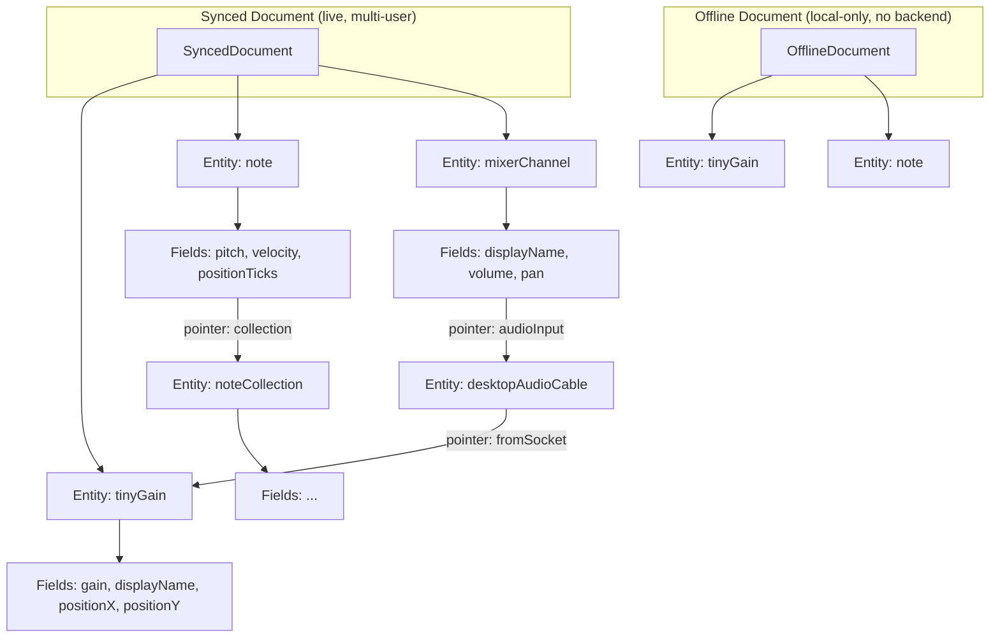

# System Overview

This page explains how the main pieces of <span class="tooltip" data-tooltip="The JavaScript package used to interact with Audiotool projects and data from your own app.">Nexus</span> fit together — what a document is, how entities work, and what happens when you open a project and start making changes.

## The Audiotool document model

An Audiotool project is stored as a <span class="tooltip" data-tooltip="The structured data that represents the contents of an Audiotool project.">**document**</span> — a collection of <span class="tooltip" data-tooltip="A single item inside a project document, such as a device, note region, or other project object.">**entities**</span>. Everything in a project is an entity: audio devices, mixer channels, timeline tracks, individual notes, cables connecting devices, and so on.

When you open a project in Nexus, you get a document object that represents the live state of that project. The document:

- holds the full set of entities currently in the project
- fires <span class="tooltip" data-tooltip="A signal that something changed, such as an entity being created, updated, or removed.">events</span> when entities are created, updated, or removed
- lets you <span class="tooltip" data-tooltip="A way to search for and retrieve specific entities or data from a document.">query</span> the current state at any moment
- lets you make changes through a <span class="tooltip" data-tooltip="A grouped set of changes made to a document as one operation.">transaction</span> system that validates and syncs your edits

## Synced vs offline documents

Nexus supports two document modes:

| Mode | How to create | What it does |
|------|--------------|--------------|
| **Synced** | `client.createSyncedDocument(...)` | Connects to a real Audiotool project via the backend. Changes are immediately broadcast to all connected collaborators. |
| **Offline** | `createOfflineDocument()` | Runs locally with no backend. All changes are lost on shutdown. Useful for testing and development. |

Both modes expose the same API — the same `modify()`, `events`, and `queryEntities` interface. This means code written against an offline document will work against a synced document too, which makes testing much easier.

## Architecture diagram



A document — whether synced or offline — contains a flat collection of entities. Each entity holds typed fields: primitive values (numbers, strings, booleans) or pointer fields that reference other entities by ID. Pointers are how relationships are expressed: a `note` points to its parent `noteCollection`, a cable points to the device sockets it connects. This flat-but-linked structure keeps individual entities small and queryable without deep object nesting.

---

## Entities

An **entity** is a small object with:

- a unique `id`
- a fixed **type** (like `"tinyGain"`, `"note"`, `"noteTrack"`)
- a set of **typed fields** defined by the schema

Each entity type has a defined set of fields. For example, a `note` entity has `positionTicks`, `pitch`, and `velocity`. A `tinyGain` device has `gain`, `positionX`, `positionY`, and `displayName`.

You cannot add arbitrary fields to entities. The schema is fixed and validated.

→ See [Entities and Fields](entities-and-fields.md) for a breakdown of every entity category.

## Pointers

Some fields in an entity hold a reference to another entity instead of a plain value. These are called **pointers**. They define how entities relate to each other.

For example:
- A `note` has a `collection` field that points to the `noteCollection` it belongs to.
- An `automationTrack` points to the device parameter it controls.

Rather than nesting objects inside one another, the document uses flat entities connected by these references.

## The modification system

You cannot change a document directly. All changes go through a <span class="tooltip" data-tooltip="The tool used to prepare and apply changes to a document.">**transaction builder**</span> obtained via `document.modify()`:

```typescript
await document.modify((t) => {
  t.create("tinyGain", { positionX: 100, positionY: 200 });
  t.update(entity.fields.gain, 0.8);
  t.remove(entity);
});
```

The three operations are:

| Operation | What it does |
|-----------|-------------|
| `t.create(type, fields)` | Creates a new entity of the given type |
| `t.update(field, value)` | Sets a field on an existing entity |
| `t.remove(entity)` | Removes an entity from the document |

Nexus applies all operations in a single `modify()` call together as one unit — either all changes succeed or none do. Multiple `modify()` calls are queued and run one at a time.

→ See [Making Changes](making-changes.md) for a full guide.

## The event system

The document fires events whenever entities change. You subscribe to these events to react to changes made by your code or by other collaborators:

```typescript
document.events.onCreate("tonematrix", (entity) => {
  console.log("A tonematrix was added:", entity);
});

document.events.onUpdate(entity.fields.gain, (newValue) => {
  console.log("Gain changed to:", newValue);
});
```

→ See [Queries and Events](queries-and-events.md) for the full event API.

## The query system

Instead of subscribing to events, you can also inspect the current state of the document at any moment using queries:

```typescript
const notes = document.queryEntities.ofTypes("note").get();
```

Queries give you a snapshot of current entity state. Events give you a live stream of changes. Use both as appropriate.

→ See [Queries and Events](queries-and-events.md).

## Lifecycle: start and stop

A synced document has a lifecycle:

1. **Create** — `client.createSyncedDocument(...)` creates the document object but does not begin syncing.
2. **Start** — `await document.start()` begins syncing with the backend. Events fire and modifications are transmitted.
3. **Stop** — `await document.stop()` finalizes any pending changes and transitions the document to read-only. After stopping, you can still query entities but cannot modify them.

Offline documents have no start/stop lifecycle — they are immediately ready for modifications.

## Where to go next

- [Documents](documents.md) — deeper look at the document object itself
- [Entities and Fields](entities-and-fields.md) — every entity category explained
- [Making Changes](making-changes.md) — how transactions work in practice
- [Queries and Events](queries-and-events.md) — how to read and react to document state
